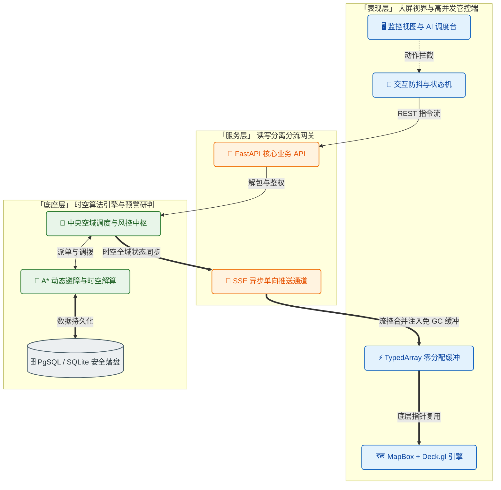

<div align="center">
  <!-- 项目专属 Logo (已缩放至最佳展示尺寸) -->
  

  <h1> AetherWeave | 苍穹织网 </h1>
  <p><strong>面向未来城市的低空物流 3D 实时调度与监控中枢</strong></p>

  <!-- 💡 占位符：各类状态徽章，可以根据实际情况在 shields.io 调整 -->
  <p>
    
    
    
    
    
  </p>

  <p>
    <a href="#-核心特性">核心特性</a> •
    <a href="#-视觉震撼">视觉演示</a> •
    <a href="#-系统架构">架构解析</a> •
    <a href="#-快速上手">快速上手</a>
  </p>
</div>

<br>

**苍穹织网 (AetherWeave)** 是一个应用于城市低空物流网络的监控与可视化调度平台。项目基于 WebGL 渲染管线与 SSE 实时数据流架构，实现了对多并发无人机（UAV）轨迹的三维追踪、风险预警以及运力调度。

本系统包含 3D 大屏态势感知、A* 三维空间避障规划、全链路审批节点以及后台数据分析等核心模块，可为低空经济领域的基建规划及日常运营提供直观的技术验证和决策辅助。

---

## 👁‍🗨 视觉

<div align="center">
  <!-- 核心大屏调度全景（已上传） -->
  
</div>

<br>

<div align="center">
  <table>
    <tr>
      <!-- 模块 1：高潮追踪录屏（已上传） -->
      <td align="center">
        <br/>
        <b>👆 镜头绑定与单机深度追踪</b><br/>
        <sub>锁定高危隐患航班，同步呈现三维历史航线与到点预估时间</sub>
      </td>
      <!-- 模块 2：AI 面板（等待开发） -->
      <td align="center">
        <br/>
        <b>👆 🚧 预留：AI 智能体大模型联控台</b><br/>
        <sub>解析模糊自然语言意图，触发底盘秒级空域避障调度重播</sub>
      </td>
    </tr>
  </table>
</div>

## ✨ 特性与功能

- 🚀 **高密度三维渲染**: 采用 `Deck.gl` 的 Binary 渲染模式与自定义 `TypedArray` 限制内存分配频率，减少 GC 卡顿。配合 LOD 优化限制不可见区域开销，系统可稳定支持 500+ 架并发 UAV 和 10 万+ 轨迹节点的高帧率大屏渲染。
- 🧠 **三维动态避障与寻路**: 后端算法应用 0.0005° 精度网格进行空间建模和线段碰撞检测，实现规避真实建筑群与多边形禁飞区的三维航线规划，支持动态地形高程匹配与路径点平滑过滤。
- ⚡️ **全链路流式调度推送**: 建立后端请求鉴权与状态机流转。通过 `FastAPI` 搭载 Server-Sent Events (SSE) 协议向下游大盘推送状态流，单向高频数据结合前端双层缓冲区（Double Buffering）合并更新，减少频繁的 DOM 重绘开销。
- 🛡 **环境仿真与异常预警**: 系统集成气温、多种天气及风场等仿真参数联动模型。无人机航线与划定禁飞区产生空间交集，或受气温载重影响导致续航电量不足时，系统会自动计算剩余余量并在界面生成 UI 预警标签。
- 🔐 **权限隔离与持久化审查**: 采用 `JWT` 角色管控架构区分大盘展示与后台派发权限。核心业务流水、飞行轨迹点与操作者派送指令均实时写入 `SQLite/PostgreSQL` 数据库，保障记录不可篡改以备朔源审查。
- 📊 **空域数据聚合与分析**: 内置基于 `ECharts` 构建的统计面板组件。聚合运行时间线内的派送状态等结构化数据，展示分时段起降热力分布、空域运力负载趋势与能耗使用统计，作为非实时情况判断的辅助。

## 🏗 架构




## 🚀 快速上手

### 1. 环境预检
- **Node.js**: >= 18.0.0
- **Python**: >= 3.10
- *无需繁杂的环境变量，内置内存数据库模式供 Demo 极速体验*

### 2. 部署运行

**步骤 一：点燃后端中枢**
```bash
git clone https://github.com/TengJiao33/AetherWeave.git
cd AetherWeave

# 我们建议您隔离使用环境：
python -m venv venv
# 激活环境 (Windows 用户运行: .\venv\Scripts\activate)
source venv/bin/activate

cd backend
# 挂载依赖并启动
pip install -r requirements.txt
python main.py  
# 此时，实时推送核心已驻守于 [http://localhost:8000]
```

**步骤 二：唤醒视觉网关**
```bash
# 请开启全新的终端
cd frontend
npm install
npm run dev     
# 登舰！请访问 [http://localhost:3000] 享受您的 3D 物流世界
```

## 📚 目录结构导览

```text
AetherWeave/
├── frontend/             # ✨ 浏览器 3D 可视化端 (React + Typescript)
│   ├── src/
│   │   ├── components/   # 高维抽象的 UI 与 Deck.gl 底层图层组件
│   │   ├── hooks/        # 管控数据流向与动画播放状态的核心 Hooks
│   │   └── utils/        # 面向二进制性能优化的 ArrayBuffer 算子
│   └── public/           # 静态纹理及回放模型数据
├── backend/              # ⚙️ 强实时调度引擎 (Python + FastAPI)
│   ├── core/             # 4D 动态航线、禁飞区计算与碰撞检测算法
│   └── api/              # 高性能 SSE 推送路由与管理面 API
├── trajectory_lab/       # 🔬 算法实验室 (环境模拟验证脚本、批量产生器)
└── docs/                 # 📖 协议定案、架构决策（ADR）与深度解析
```


## 团队成员

> 💡 **占位提示**: 这里请写入各位团队成员的名字、主要负责模块、指导老师姓名以及已获奖项。
- **项目指导**：[杨正益]
- **核心开发组**：
  - [应飞扬][邓博][谢丽欣][罗楚瑞]

## 📜 开源与法律声明

本项目代码基于 [MIT License](./LICENSE) 协议发布。
允许用于非商业和商业性质的学习与二次开发，但对于数据安全与实飞环境的使用，后果需自行承担。

---
<div align="center">
  <sub>在星云般的数据流中，我们重塑城市低空的秩序。</sub><br/>
  <sup>Built with passion in 2026.</sup>
</div>
