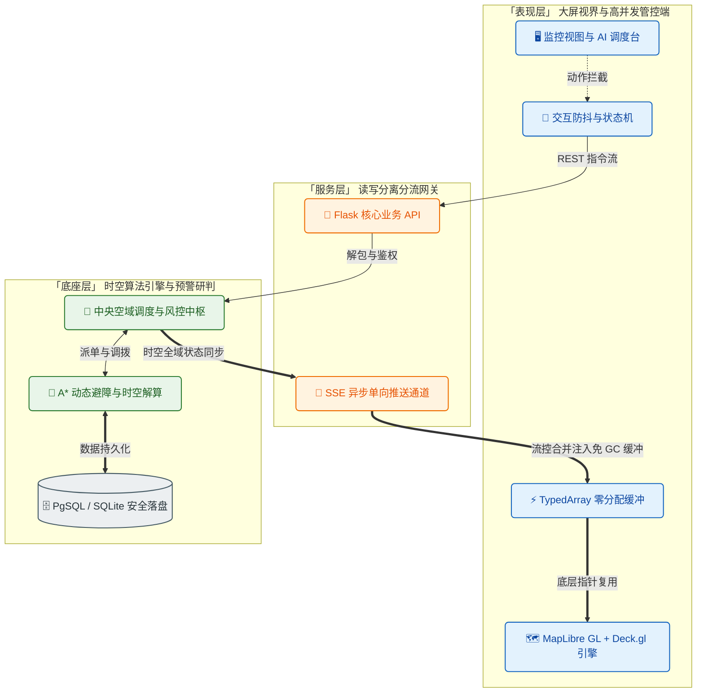

<div align="center">
  <!-- 项目专属 Logo (已缩放至最佳展示尺寸) -->
  

  <h1> AetherWeave | 苍穹织网 </h1>
  <p><strong>低空经济AI数字孪生引擎</strong></p>
  <p><sub>基于AI数字孪生与时空流计算的低空经济智能调度中枢</sub></p>

  <!-- 💡 核心技术栈状态徽章 -->
  <p>
    
    
    
    
    
    
    
  </p>

  <p>
    <a href="#-核心特性">核心特性</a> •
    <a href="#-视觉震撼">视觉演示</a> •
    <a href="#-系统架构">架构解析</a> •
    <a href="#-快速上手">快速上手</a>
  </p>
</div>

<br>

**苍穹织网 (AetherWeave)** 是一个基于AI数字孪生与时空流计算的低空经济智能调度中枢。项目基于 WebGL 渲染管线与 SSE 实时数据流架构，实现了对多并发无人机（UAV）轨迹的三维追踪、风险预警以及运力调度。

本系统包含 3D 大屏态势感知、A* 三维空间避障规划、全链路审批节点以及后台数据分析等核心模块，可为低空经济领域的基建规划及日常运营提供直观的技术验证和决策辅助。

---

## 👁‍🗨 视觉

<div align="center">
  <!-- 核心大屏调度全景 -->
  <video src="https://github.com/user-attachments/assets/e57a241b-572e-4588-a407-b7da5a08baae" autoplay loop muted playsinline style="width: 100%;"></video>
</div>

<br>

<div align="center">
  <table>
    <tr>
      <!-- 模块 1：镜头追踪 -->
      <td align="center">
        <video src="https://github.com/user-attachments/assets/20f0dbe0-786d-4130-bfa8-233cb6e646d7" autoplay loop muted playsinline style="width: 100%;"></video><br/>
        <b>👆 镜头绑定与单机深度追踪</b><br/>
        <sub>锁定高危隐患航班，同步呈现三维历史航线与到点预估时间</sub>
      </td>
      <!-- 模块 2：ROI 沙盘 -->
      <td align="center">
        <br/>
        <b>👆 🗺️ 基建 ROI 沙盘 (DSS 辅助决策引擎)</b><br/>
        <sub>支持双点 A/B 博弈、财务闭环测算与 3D 雷达激波渲染，赋能城市低空基建选址规划</sub>
      </td>
    </tr>
  </table>
</div>

## ✨ 特性与功能

- 🚀 **三维大屏渲染**: 前端用 `Deck.gl` 做 WebGL 渲染，轨迹数据走 `TypedArray` 避免频繁 GC，远处建筑做了 LOD 降级。实测 500+ 架无人机同屏、10 万级轨迹点跑下来帧率基本稳定。
- 🧠 **A* 三维避障**: 后端把地图按 0.0005° 切成网格，拿 Shapely 做线段-多边形碰撞检测，航线会自动绕开建筑和禁飞区。路径算完之后还做了贝塞尔平滑，飞出来不会有硬拐弯。
- ⚡️ **SSE 实时推送**: 没有用 WebSocket，而是选了 SSE（Server-Sent Events）做服务端单向推送，实现简单够用。前端拿双缓冲区攒数据，合并后一次性更新图层，减少重绘次数。
- 🛡 **天气仿真 + 预警**: 可以调节风速、气温、天气类型，这些参数会实际影响无人机的电量消耗模型。航线穿了禁飞区或者电量算下来不够飞，界面上会直接标红告警。
- 🔐 **JWT 鉴权与审计**: 分了 ADMIN / DISPATCHER / VIEWER 三种角色，不同角色看到的操作面板不一样。所有派单记录和轨迹数据都落库（SQLite / PostgreSQL），方便回溯。
- 📊 **数据分析看板**: 单独做了一个 `/analytics` 页面，用 `ECharts` 画了六个维度的图表——分时段订单量、城市运力对比雷达图、能耗分布、告警统计这些，算是给运营提供数据参考。

## 🏗 架构




## 🚀 快速上手

### 1. 环境预检
- **Node.js**: >= 18.0.0
- **Python**: >= 3.10
- *无需繁杂的环境变量，内置内存数据库模式供 Demo 极速体验*

### 2. 部署运行

**步骤一：启动后端服务**
```bash
git clone https://github.com/TengJiao33/AetherWeave.git
cd AetherWeave

# 推荐使用虚拟环境：
python -m venv venv
# 激活环境 (Windows 用户运行: .\venv\Scripts\activate)
source venv/bin/activate

cd backend
# 安装依赖并启动
pip install -r requirements.txt
python scripts/server.py
# 后端服务已运行在 http://localhost:5001
```

**步骤二：启动前端大屏面板**
```bash
# 请开启全新的终端
cd frontend
npm install
npm run dev     
# 访问 http://localhost:5173 查看 3D 面板
```

## 📚 目录结构导览

```text
AetherWeave/
├── frontend/                 # 浏览器 3D 可视化端 (React 19 + TypeScript + Vite)
│   ├── src/
│   │   ├── components/       # UI 与 Deck.gl 图层组件
│   │   ├── contexts/         # 全局状态管理 (认证、环境仿真)
│   │   ├── hooks/            # 数据流向与状态管理 (动画、图层、SSE)
│   │   ├── features/         # 独立功能模块 (引导、加载进度)
│   │   ├── types/            # TypeScript 类型定义
│   │   └── utils/            # ArrayBuffer 性能优化与工具函数
│   └── public/               # 3D 模型、静态纹理及 GeoJSON 数据
├── backend/           # 后端服务与算法引擎 (Python + Flask)
│   ├── scripts/server.py     # Flask 主服务 (认证、调度、SSE、ROI 分析)
│   ├── core/                 # A* 空域避障、NFZ 碰撞检测、POI 匹配
│   ├── models/               # SQLAlchemy ORM 模型 (用户、任务)
│   └── tests/                # 后端单元测试
├── scripts/                  # 数据处理工具 (轨迹生成、能耗建模、城市数据获取)
├── data/                     # 原始数据与处理后数据 (GeoJSON, CSV)
└── docs/                     # 技术文档与架构说明
```


## 团队成员

<div align="center">
  
  <br/>
  <sub><b>大数据与软件学院</b></sub>
</div>

<br/>

- **指导老师**：杨正益
- **核心开发组**：应飞扬、邓博、谢丽欣、罗楚瑞

## 📜 开源与法律声明

本项目代码基于 [MIT License](./LICENSE) 协议发布。
允许用于非商业和商业性质的学习与二次开发，但对于数据安全与实飞环境的使用，后果需自行承担。

---
<div align="center">
  <sup>© 2026 AetherWeave Team. MIT Licensed.</sup>
</div>
