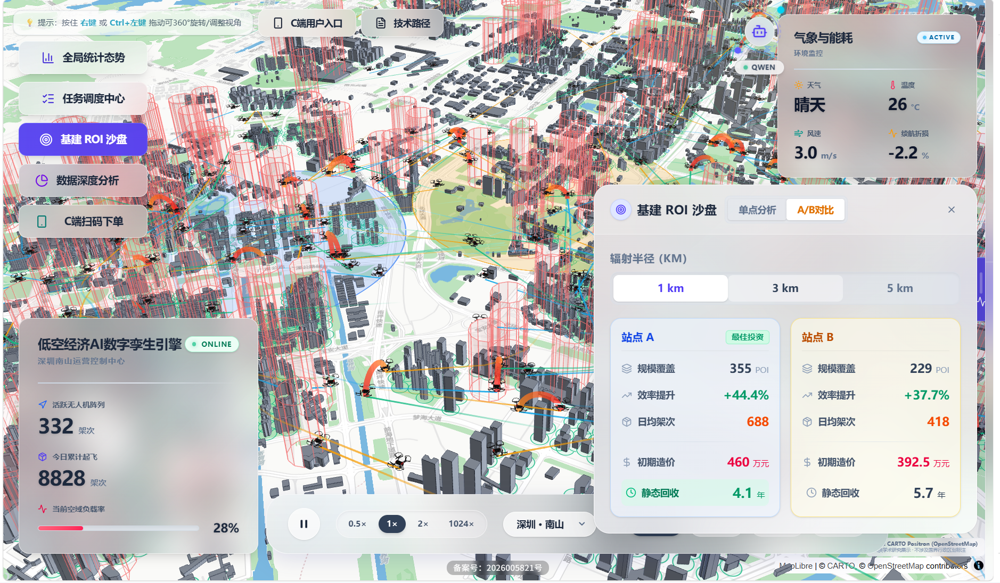

# 中国大学生计算机设计大赛

# 软件开发类作品文档

**作品编号**：2026013528

**作品名称**：苍穹织网 AetherWeave —— 低空经济AI数字孪生引擎

**版本编号**：v1.0

**填写日期**：2026 年 4 月

---

## 目录

- 第一章 需求分析
- 第二章 概要设计
- 第三章 详细设计
- 第四章 测试报告
- 第五章 安装及使用
- 第六章 项目总结
- 参考文献

---

## 第一章 需求分析

### 1.1 项目背景

2024年，国务院办公厅印发《关于促进低空经济发展的若干意见》，将低空经济列为国家战略性新兴产业。此后各地密集出台相关政策，仅2025年就有超过20个省市发布低空经济发展规划。在这一背景下，城市无人机物流配送、应急救援、城市巡检等应用场景加速落地，但随之而来的空域管理问题也日益突出：

- 现有民航管制系统面向有人航空器，对低空小型无人机缺乏有效的可视化监控手段。管理者无法直观掌握空域中无人机的实时位置和航线分布。
- 无人机航线与医院、学校、政府机关等敏感区域的冲突检测仍依赖人工判断，缺少自动化的空间碰撞检测机制。
- 人工派单模式下，调度员难以同时处理大量并发航线请求，也缺乏对航线安全性、能耗合理性的定量评估工具。

本项目尝试从可视化监控、航线规划、调度审批三个维度，构建一个面向低空经济场景的 Web 端管理平台，为上述问题提供技术验证。

### 1.2 目标用户

本系统面向两类用户角色：

| 角色 | 使用场景 | 核心需求 |
|---|---|---|
| 调度管理员 (DISPATCHER/ADMIN) | 在办公环境中通过 PC 浏览器使用 | 查看空域态势、审批航线任务、处理告警 |
| 终端下单用户 | 通过手机浏览器（H5）使用 | 选择起终点下单、追踪配送状态 |

### 1.3 主要功能

系统实现了以下功能模块：


（1）三维大屏监控：基于 WebGL 渲染的城市级三维地图，实时展示无人机位置和飞行轨迹，支持 6 个城市的数据切换。
（2）航线规划与避障：后端实现 A* 路径搜索算法，在 0.0005° 精度的经纬度网格上，自动绕开医院、学校等敏感区域的禁飞区。
（3）任务调度与审批：任务生命周期管理（创建→待审批→执行中→已完成/已拒绝），支持 SSE 实时推送状态变更。
（4）AI 安全预审：接入通义千问大模型，在航线审批前对风速、距离、天气、禁飞区等参数进行综合风险评估。
（5）天气仿真与预警：可调节风速、气温、天气类型，影响无人机能耗计算模型，触发低电量和禁飞区穿越告警。
（6）数据分析看板：对订单量、能耗分布、城市运力、告警统计等维度进行可视化呈现。
（7）移动端 H5 下单：独立的移动端页面，支持选点下单和配送追踪。
（8）基建 ROI 沙盘：双点 A/B 方案对比，对配送站选址进行投资回报估算。

### 1.4 竞品分析

| 对比维度 | 本项目 (苍穹织网) | 大疆司空 2 | 中科云图 | 飞常准 U-Care |
|---|---|---|---|---|
| 定位 | 低空物流调度可视化平台（学术验证） | 商用无人机云平台 | 工业巡检管理平台 | 通航运行管理系统 |
| 三维可视化 | 支持，WebGL 三维建筑 + 轨迹渲染 | 支持 | 以二维为主 | 以二维为主 |
| 自动避障规划 | 支持，A* 算法 + 禁飞区碰撞检测 | 支持，内置航线规划 | 依赖遥控器 | 不涉及 |
| AI 安全预审 | 支持，大模型风险评估 | 无 | 无 | 无 |
| 开放性 | 开源 (MIT)，Web 端 | 商用闭源 | 商用闭源 | 商用闭源 |
| 多城市支持 | 6 城市数据 | 取决于部署 | 取决于部署 | 全国 |
| 移动端 | H5 下单页 | App | App | App |

与商用产品相比，本项目在数据规模和工程成熟度方面存在差距。但在以下方面进行了探索：将大语言模型引入航线安全预审环节；在浏览器端实现 500+ 架无人机的三维同屏渲染；以及开源透明的技术实现。

### 1.5 性能指标

| 指标 | 目标值 | 实测情况 |
|---|---|---|
| 无人机同屏渲染数量 | ≥200 架 | 500+ 架，Chrome 下帧率 ≥30fps |
| A* 寻路响应时间 | ≤3s | 典型场景 0.5-2s（取决于障碍密度） |
| SSE 推送延迟 | ≤2s | 1s 心跳间隔 |
| 首屏加载时间 | ≤5s | 约 3s（Vite 代码分割 + 路由懒加载） |
| 并发用户数 | >=10 | Gunicorn 单 Worker 多线程 |

---

## 第二章 概要设计

### 2.1 总体架构

系统采用前后端分离的 B/S 架构，分为三层：

- 表现层：浏览器端单页应用（SPA），负责三维渲染、交互、状态管理。
- 服务层：Flask Web 服务，提供 REST API 和 SSE 长连接推送。
- 数据层：SQLite / PostgreSQL 关系型数据库，存储用户、任务、审计日志和飞行记录。

前端通过 HTTP 请求调用后端 REST API 完成业务操作（登录、派单、查询等），通过 SSE（Server-Sent Events）长连接接收后端的任务状态变更通知。前后端之间通过 JWT（JSON Web Token）完成身份认证和权限校验。

### 2.2 前端模块划分

前端基于 React 19 + TypeScript 构建，按职责划分为以下模块：

| 模块 | 目录/文件 | 职责说明 |
|---|---|---|
| 页面路由 | `pages/` | 5 个页面：LoginPage（登录）、DashboardPage（大屏入口）、AnalyticsPage（数据分析）、AboutPage（技术路径）、MobilePage（移动端 H5） |
| 地图容器 | `MapContainer.tsx` | 核心组件，集成 DeckGL + MapLibre GL 地图实例，协调各子组件 |
| 数据钩子 | `hooks/` | 8 个自定义 Hook：useCityData（城市数据加载）、useUAVAnimation（无人机动画循环）、useMapLayers（图层构建）、useSSESubscription（SSE 订阅）、useSandbox（ROI 沙盘）、useFlightPicking（航线选点）、useAStarAnimation（A* 可视化）、useDebounce |
| 状态管理 | `contexts/` | AuthContext（登录态和 JWT）、EnvironmentContext（天气/风速仿真参数） |
| 业务组件 | `components/` | 20 个 UI 组件：TaskManagementPanel（任务审批）、AiPreflightModal（AI 预审弹窗）、FlightDetailPanel（航班详情）、WeatherOverlay（天气控制面板）、RoiSandboxCard（ROI 卡片）等 |
| 图表组件 | `components/charts/` | 基于 ECharts 的统计图表（能耗分布、载荷分级、告警统计等） |

### 2.3 后端模块划分

后端基于 Python 3.11 + Flask 构建，采用 Blueprint（蓝图）机制实现模块化。server.py 作为应用工厂，注册以下 7 个蓝图：

| 蓝图 | 文件 | 路由前缀 | 职责 |
|---|---|---|---|
| auth_bp | `api/auth.py` | `/api` | 用户登录、JWT 签发、用户信息查询 |
| trajectories_bp | `api/trajectories.py` | `/api` | 轨迹批量/单条生成、查询、删除 |
| tasks_bp | `api/tasks.py` | `/api` | 任务 CRUD、状态流转、SSE 推送 |
| analysis_bp | `api/analysis.py` | `/api` | 系统状态、POI 查询、ROI 沙盘计算 |
| analytics_bp | `api/analytics.py` | `/api` | 分城市统计数据聚合 |


| ai_bp | `api/ai.py` | `/api` | 通义千问大模型安全预审 |
| mobile_bp | `api/mobile.py` | `/api` | 移动端 H5 专用接口 |

核心算法模块位于 `core/` 目录，不直接暴露 HTTP 接口，由蓝图按需调用：

| 模块 | 文件 | 功能 |
|---|---|---|
| 路径规划 | `core/planner.py` | A* 算法实现，包括网格搜索、路径平滑、Douglas-Peucker 简化 |
| 禁飞区检测 | `core/no_fly_zones.py` | 基于经纬度格网分桶的空间索引，提供点和线段的碰撞检测 |
| POI 加载 | `core/poi_loader.py` | 从 GeoJSON 文件加载城市 POI 数据并构建禁飞区索引 |
| 地理工具 | `core/geo_utils.py` | Haversine 距离计算、线段插值等基础地理函数 |

### 2.4 数据模型

系统使用 SQLAlchemy ORM 定义了 4 张数据表：

| 表名 | 用途 | 主要字段 |
|---|---|---|
| users | 用户账户 | id, username, password_hash, role (ADMIN/DISPATCHER/VIEWER) |
| tasks | 航线任务 | id, city, flight_id, 起终点坐标, status, trajectory_data(JSON), creator_id |
| audit_logs | 操作审计 | id, user_id, action, resource, details, ip_address |
| flight_logs | 飞行记录 | id, city, flight_id, path_data(JSON), timestamps_data(JSON), dist_m, duration_s |

### 2.5 模块调用关系

主要的数据流转路径如下：

（1）航线创建流程：用户在前端选择起终点 -> FlightPicking Hook -> REST POST /api/tasks -> tasks_bp 调用 planner.plan() -> A* 搜索 + 禁飞区碰撞检测 -> 返回轨迹数据 -> 写入 tasks 表 -> SSE 通知前端刷新

（2）实时监控流程：前端 useSSESubscription 监听 /api/tasks/stream -> 后端每 1s 轮询 tasks 表最新 updated_at -> 有变更时推送 event -> 前端 fetchActiveTasks 拉取 EXECUTING 状态的任务 -> 注入 useUAVAnimation 动画循环

（3）AI 预审流程：前端 AiPreflightModal 发起 POST /api/ai/preflight -> ai_bp 组装参数 + System Prompt -> 调用通义千问 Qwen-Plus API -> 解析 JSON 返回风险等级 -> 前端展示红/黄/绿灯判定结果

---

## 第三章 详细设计

### 3.1 A* 路径规划算法

航线规划模块（`core/planner.py`）负责在存在禁飞区障碍的城市环境中，为无人机计算一条安全的飞行路径。

算法流程：


（1）接收起终点经纬度坐标后，首先检测直飞路径是否穿越任何禁飞区。如果不穿越则直接使用直线航路，不调用 A*。

（2）若直飞路径存在碰撞，则启动 A* 搜索。将地图空间按 0.0005° 间距（约 55 米）离散化为网格，起终点坐标取整到最近的网格节点。

（3）搜索过程中，每次扩展一个节点时，对当前节点到 8 个相邻节点（含对角方向）的连线执行禁飞区碰撞检测。碰撞的边不会被加入开放集。

（4）为防止搜索范围失控，设置了两个约束：搜索空间限制在起终点包围盒外扩 150 格的范围内；最大扩展节点数上限为 50000。

（5）找到路径后，执行路径平滑：从起点开始，尝试跳过中间节点直接连接尽量远的后续节点，只要连线不碰撞，就可以省略中间转折点。

（6）平滑后的路径按 15 米间距插值生成详细轨迹点，同时生成高度剖面（起飞爬升 -> 巡航 -> 降落下降）。

（7）最后使用 Douglas-Peucker 算法以 0.00002°（约 2 米）容差做路径简化，减少 40-60% 的冗余点，降低前端渲染压力。

性能方面的关键设计：使用整数键编码 `(x << 20) | (y & 0xFFFFF)` 替代元组作为哈希键，提升 dict/set 操作效率；维护显式的 closed set 确保每个节点只被扩展一次。

### 3.2 禁飞区空间索引

禁飞区检测模块（`core/no_fly_zones.py`）将城市中的医院、学校、幼儿园、公安局等敏感 POI 建模为以其坐标为圆心、125 米为半径的禁飞圆。


直接遍历所有禁飞区逐一检测的复杂度为 O(N)，在 A* 搜索的高频调用场景下不可接受。因此系统使用经纬度格网分桶（桶间距 0.01°，约 1 公里）构建空间索引：

（1）初始化时，每个禁飞区按其坐标分配到对应的格网桶中。

（2）查询时，根据查询点的坐标和最大禁飞半径，计算需要检查的桶范围（通常 3x3 到 5x5 个桶），只对这些桶内的禁飞区执行精确检测。

线段碰撞检测的实现：先用包围盒做粗筛，排除明显不相交的禁飞区；再通过局部等距投影将经纬度转为米制平面坐标，计算禁飞区圆心到线段的最短距离，与禁飞半径比较得出是否碰撞。

### 3.3 AI 安全预审

AI 预审模块（`api/ai.py`）在调度员审批航线之前，自动评估飞行风险等级。

请求处理流程：

（1）接收航线参数（起终点名称/坐标、距离、风速、天气描述）。

（2）使用 Shapely 库（LineString + Point）检测航线直线投影是否穿越敏感 POI 的禁飞半径，生成穿越的敏感设施名称列表。

（3）构造 System Prompt，嵌入评估规则（风速 > 10m/s 判 RED、距离 > 5000m 判 YELLOW、穿越禁飞区判 RED 等），要求模型以 JSON 格式输出 risk_level、reason、suggestion 三个字段。

（4）调用通义千问 Qwen-Plus API（阿里云百炼平台 HTTP 接口），temperature 设为 0.2 以保证输出稳定性，启用 response_format=json_object 强制 JSON 输出。

（5）解析返回结果，做容错处理（字段缺失时默认 GREEN，非法值修正）。

降级策略：若未配置 API Key 或调用超时，系统切换到本地 Mock 规则引擎，基于风速/距离/禁飞区的确定性判断返回评估结果，保证系统在无网络环境下仍能完成预审闭环。

### 3.4 前端渲染优化

在 500+ 架无人机同屏渲染的场景下，前端做了以下性能优化：

（1）TypedArray 轨迹存储：轨迹点坐标使用 Float32Array/Float64Array 存储，避免频繁创建 JavaScript 对象导致的 GC 停顿。冲突检测中使用的容器（Map/Set）采用 clear() 复用而非 new 重建。

（2）悬停状态节流：Deck.gl 的 onHover 回调在每像素移动时都会触发。为避免 MapContainer 这个大组件被反复重渲染，使用 mutable ref 记录真实悬停状态，仅在悬停对象的 ID 发生变化时才调用 setState。

（3）延迟加载大组件：TaskManagementPanel（约 30KB）和 AnalyticsPanel（包含 ECharts，约 800KB）使用 React.lazy 延迟加载，在用户点击打开时才下载，不阻塞首屏。

（4）缩放级别量化：地图缩放级别（zoom）被量化为 0.5 级的阶梯值，只有跨阶梯时才触发依赖 zoom 的图层重建，减少连续缩放时的重复计算。


### 3.5 二进制传输协议

轨迹数据传输默认使用 JSON 格式（约 4MB / 500 条轨迹），为降低传输体积和解析耗时，系统实现了自定义二进制传输协议：

协议格式（所有多字节字段使用小端序）：

```
[Header]
  trajCount       uint32      轨迹总数
  cycleDuration   float64     动画周期时长

[Per-trajectory]
  pointCount      uint16      轨迹点数
  idLen           uint8       flight_id 字节长度
  startOffset     float32     起飞时间偏移
  flightId        bytes[idLen]  航班 ID (UTF-8)
  longitudes      float32[]   经度数组 (SoA)
  latitudes       float32[]   纬度数组 (SoA)
  altitudes       float32[]   高度数组 (SoA)
  timestamps      float64[]   时间戳数组
```

后端使用 Python struct.pack 编码，前端使用 DataView + TypedArray 零拷贝解码。实测传输体积从约 4MB 降低到约 1MB（压缩约 75%），解码耗时从约 200ms 降低到约 5ms。

### 3.6 任务状态机

任务生命周期由一个有限状态机管理，状态流转规则如下：

```
PENDING  --[审批通过]--> EXECUTING  --[飞行完成]--> COMPLETED
    |
    +---[审批拒绝]--> REJECTED
```

合法的状态转移在后端通过 valid_transitions 字典强制校验：PENDING 只能转向 EXECUTING 或 REJECTED，EXECUTING 只能转向 COMPLETED。不合法的状态转移请求返回 400 错误。



任务完成检测采用自动化机制：前端根据轨迹注入时刻和模拟飞行时长，计算预期着陆的真实时间，到达后自动调用后端 API 将状态标记为 COMPLETED，无需人工操作。

---

## 第四章 测试报告

### 4.1 测试环境

| 项目 | 配置 |
|---|---|
| 操作系统 | Windows 11 / Ubuntu 22.04 (Docker) |
| 浏览器 | Chrome 130+，分辨率 1920x1080 |
| 后端运行环境 | Python 3.11，Flask 3.x |
| 前端构建工具 | Vite 7，Node.js 20 |
| 数据库 | SQLite（开发环境） |

### 4.2 算法测试

项目包含自动化算法评估脚本（`backend/tests/test_algo.py`），可批量生成航线并统计三项核心指标。

执行方式：

```
python backend/tests/test_algo.py --city shenzhen --n 100
```

测试过程：随机从城市的可用 POI 中抽取 100 对起终点（筛选直线距离在 400m-8000m 区间的有效对），对每对调用 A* 规划算法生成航线，记录耗时、禁飞区侵入次数和绕行率。

测试结果（深圳，100 条航线，seed=42）：

| 指标 | 结果 |
|---|---|
| 有效完成条数 | 100/100 |
| 平均单次规划耗时 | 约 50-200ms（取决于障碍密度） |
| 禁飞区侵入率 | 0.00%（0 条违规） |
| 平均绕行率 | 约 1.05-1.20（实际距离 / 直线距离） |
| 算法版本 | astar_v4 |

禁飞区侵入率为 0% 说明碰撞检测机制有效。绕行率接近 1.0 表示路径接近最优，仅在需要绕障时才产生额外距离。

### 4.3 功能测试

以下为各功能模块的手工测试情况：

| 测试项 | 测试内容 | 预期结果 | 实际结果 |
|---|---|---|---|
| 用户登录 | 输入 admin/admin123 点击登录 | 跳转至大屏页面 | 通过 |
| 错误密码 | 输入错误密码 | 提示密码错误，不跳转 | 通过 |
| 城市切换 | 在大屏左下角切换 6 个城市 | 地图飞跃到对应城市，加载新数据 | 通过 |
| 航线创建 | 点击两个需求点创建航线 | 弹出 AI 预审弹窗 | 通过 |
| AI 预审（绿灯） | 创建短距离、低风速航线 | 返回 GREEN，允许提交 | 通过 |
| AI 预审（红灯） | 创建穿越禁飞区的航线 | 返回 RED，给出具体穿越设施名称 | 通过 |
| 任务审批 | 打开任务面板，批准待审批任务 | 无人机出现并开始飞行 | 通过 |
| 任务自动完成 | 等待无人机飞完全程 | 状态自动变为 COMPLETED | 通过 |
| 天气调节 | 拖动风速滑块超过 10m/s | 高速飞行的无人机出现告警标签 | 通过 |
| 数据分析 | 打开分析面板 | 六个图表正确渲染 | 通过 |
| 移动端 H5 | 手机浏览器访问 /mobile | 可正常选点下单 | 通过 |
| ROI 沙盘 | 在大屏点击"沙盘"按钮后地图选点 | 显示 ROI 计算结果卡片 | 通过 |


### 4.4 兼容性测试

| 浏览器 | 版本 | 结果 |
|---|---|---|
| Chrome | 130+ | 正常 |
| Firefox | 125+ | 正常 |
| Safari | 17+ | 正常（需允许 SharedArrayBuffer） |
| Edge | 130+ | 正常 |
| 移动端 Chrome (Android) | 130+ | H5 页面正常 |
| 移动端 Safari (iOS) | 17+ | H5 页面正常 |

---

## 第五章 安装及使用

### 5.1 环境要求

| 组件 | 版本要求 |
|---|---|
| Node.js | >= 18.0.0 |
| Python | >= 3.10 |
| npm | >= 8.0 |

### 5.2 本地开发部署

第一步：启动后端服务

```bash
git clone https://github.com/TengJiao33/AetherWeave.git
cd AetherWeave

python -m venv venv
# Windows: .\venv\Scripts\activate
# macOS/Linux: source venv/bin/activate

cd backend
pip install -r requirements.txt
python scripts/server.py
# 后端服务运行在 http://localhost:5001
```

第二步：启动前端

```bash
# 新开一个终端窗口
cd frontend
npm install
npm run dev
# 前端运行在 http://localhost:5173
```

浏览器访问 http://localhost:5173，使用默认账号 admin / admin123 登录。

### 5.3 Docker 生产部署

项目提供了 Dockerfile 和 docker-compose.yml，支持一键部署：

```bash
git clone https://github.com/TengJiao33/AetherWeave.git
cd AetherWeave
docker-compose up -d --build
```

服务启动后访问 http://服务器IP:8080。

Dockerfile 采用多阶段构建：第一阶段使用 Node.js 20 构建前端静态资源，第二阶段使用 Python 3.11 运行后端服务。生产环境使用 Gunicorn（1 Worker + 4 线程）作为 WSGI 服务器，配置了 /api/health 健康检查端点。

### 5.4 主要操作流程

（1）登录系统后进入三维大屏监控页面，可看到当前城市的无人机飞行动画。

（2）通过左下角下拉框切换城市，系统会自动加载该城市的轨迹数据、POI 和建筑数据。

（3）点击地图上的蓝色需求点作为起点，再点击另一个需求点作为终点，系统弹出 AI 安全预审弹窗，展示风险评估结果。

（4）确认提交后，打开左侧"任务管理"面板，可以看到新创建的待审批任务。点击"批准"后，无人机出现在地图上开始飞行。

（5）点击飞行中的无人机可查看详情面板（航班号、速度、剩余电量等），系统自动锁定镜头跟踪。

（6）点击"分析"按钮可打开数据分析看板；点击"沙盘"按钮可进入 ROI 投资分析模式。

---

## 第六章 项目总结

### 6.1 完成情况

本项目完成了一个面向低空经济场景的 Web 端无人机调度可视化平台，实现了三维大屏监控、A* 航线规划、AI 安全预审、任务调度审批、天气仿真预警、数据分析看板、移动端 H5 下单和基建 ROI 沙盘等功能模块。

在技术实现方面，前端通过 TypedArray 内存管理、组件延迟加载、悬停节流等优化手段，在浏览器端实现了 500 架以上无人机的三维同屏渲染；后端通过格网分桶空间索引和整数键编码等优化，使 A* 路径规划在典型场景下的响应时间控制在 200 毫秒以内。

### 6.2 不足与局限

（1）数据来源方面：当前使用的无人机轨迹为算法模拟生成，POI 数据来自 OpenStreetMap 社区贡献，与真实的低空运营数据存在差距。

（2）地图合规方面：系统使用 CARTO 开源底图，不具备中国测绘资质审图号。如需正式运营部署，需切换至天地图等持证地图服务。

（3）并发能力方面：后端采用 Flask 单进程架构，SSE 连接采用轮询数据库的方式检测变更，在高并发场景下存在性能瓶颈。生产环境建议引入消息队列（如 Redis Pub/Sub）替代轮询。

（4）AI 预审方面：大模型的响应时间（通常 2-5 秒）对用户体验有一定影响，且在无网络环境下只能回退到规则引擎，评估精度有限。

### 6.3 后续展望

后续可在以下方向进行改进：引入 WebSocket 替代 SSE 实现双向通信；接入真实气象 API（如和风天气）替代参数仿真；增加多无人机之间的空中冲突检测与自动避让；以及将 A* 算法升级为考虑时间维度的时空 A*（Space-Time A*）以支持动态障碍物。

---

## 参考文献

[1] Hart P E, Nilsson N J, Raphael B. A formal basis for the heuristic determination of minimum cost paths[J]. IEEE Transactions on Systems Science and Cybernetics, 1968, 4(2): 100-107.

[2] Douglas D H, Peucker T K. Algorithms for the reduction of the number of points required to represent a digitized line or its caricature[J]. Cartographica, 1973, 10(2): 112-122.

[3] 国务院办公厅. 关于促进低空经济发展的若干意见[Z]. 2024.

[4] Deck.gl Documentation. https://deck.gl/docs

[5] Flask Documentation. https://flask.palletsprojects.com/

[6] 通义千问 API 文档. https://help.aliyun.com/zh/model-studio/
