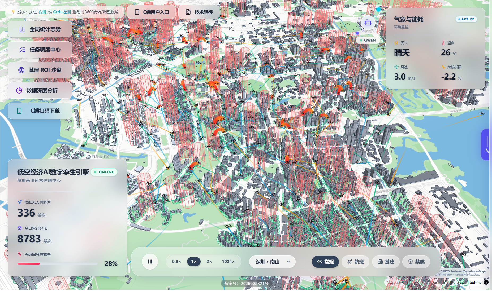
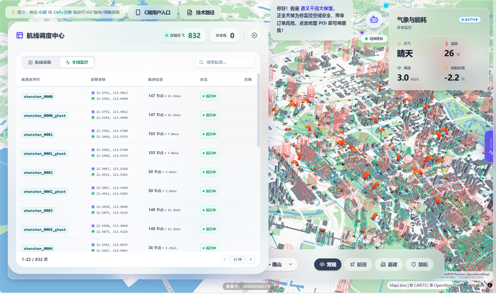
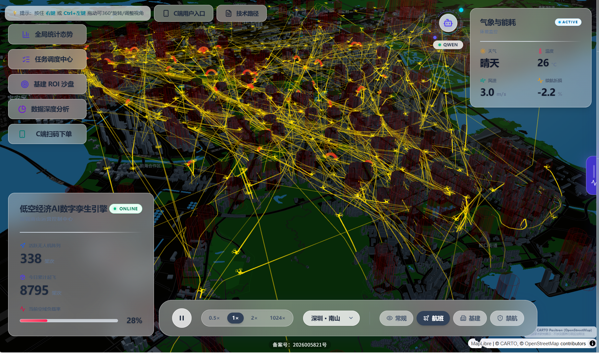
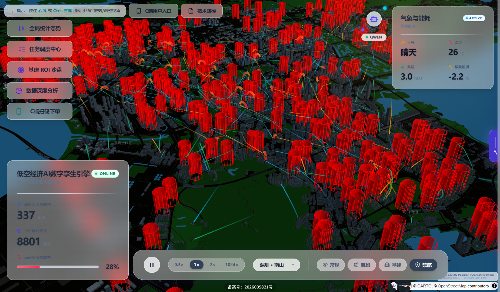
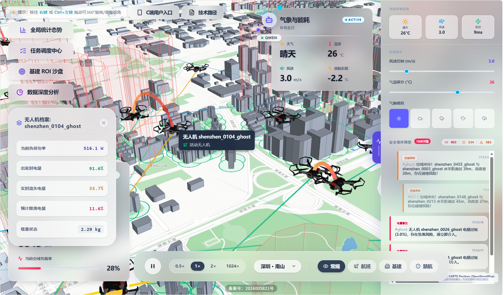
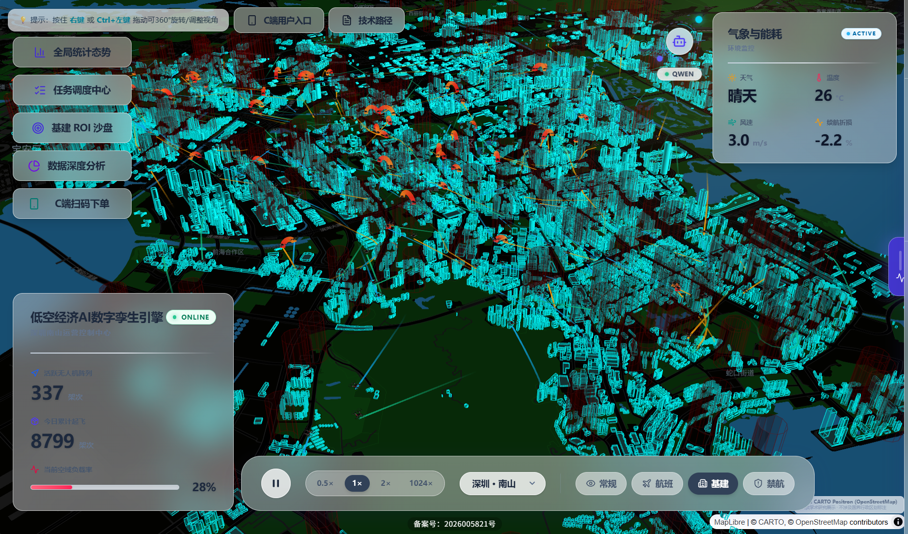
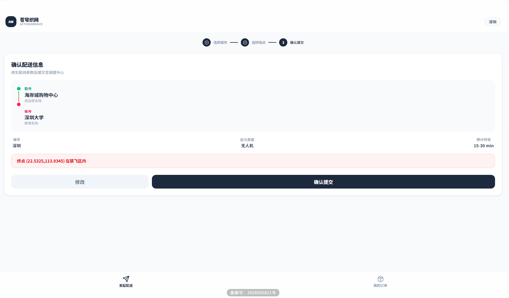
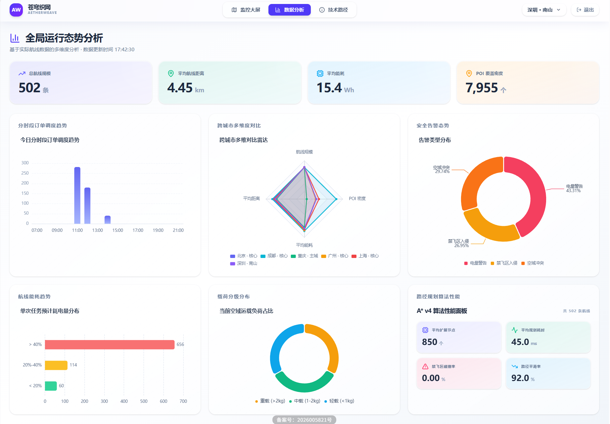

# 中国大学生计算机设计大赛

# 软件开发类作品文档

**作品编号**：2026013528

**作品名称**：苍穹织网 AetherWeave —— 低空经济 AI 数字孪生引擎

**版本编号**：v1.1

**填写日期**：2026 年 4 月

---

## 目录

- 第一章 需求分析
- 第二章 概要设计
- 第三章 详细设计
- 第四章 测试报告
- 第五章 安装及使用
- 第六章 项目总结
- 参考文献

---

## 第一章 需求分析

### 1.1 项目背景

低空经济进入政策加速期后，城市级无人机配送、巡检和应急调度对“可视化、可规划、可审批”的低空管理平台提出了更高要求。现有方案要么偏向商用封闭平台，要么偏向单点功能演示，难以同时覆盖三维监控、禁飞区避障、任务审批和数据分析等教学与竞赛场景。因此，本项目围绕“低空物流调度”这一典型业务链路，设计了一个可演示、可扩展、可验证的 Web 平台。

### 1.2 目标用户

| 角色 | 使用场景 | 核心需求 |
|---|---|---|
| 调度管理员（ADMIN / DISPATCHER） | PC 浏览器 | 查看空域态势、审批任务、处理告警、分析运力 |
| 普通查看用户（VIEWER） | PC 浏览器 | 查看飞行态势与任务结果 |
| 终端下单用户 | 手机浏览器（H5） | 选择起终点下单、查看订单进度 |

### 1.3 主要功能



| 功能模块 | 说明 |
|---|---|
| 三维大屏监控 | 基于 MapLibre GL + Deck.gl 的城市级三维地图，展示建筑、需求点、敏感点和无人机轨迹 |
| 航线规划与避障 | 后端使用 A* 算法规划路径，自动绕开医院、学校等敏感区域禁飞圈 |
| 任务调度与审批 | 支持任务创建、审批、执行、完成、拒绝等状态流转，并通过 SSE 推送变更 |
| AI 安全预审 | 调用通义千问 Qwen-Plus，对风速、距离、天气、禁飞区风险进行预判 |
| 天气仿真与预警 | 调节风速、温度、天气类型，联动能耗和飞行安全提示 |
| 数据分析看板 | 展示订单量、告警数、能耗分布、城市运力对比等统计结果 |
| 移动端 H5 下单 | 提供独立 `/mobile` 页面，支持轻量下单和订单查询 |
| ROI 沙盘 | 对候选站点做 A/B 投资回报对比，辅助基建选址分析 |

### 1.4 竞品分析

| 对比维度 | 本项目（苍穹织网） | 大疆司空 2 | 中科云图 | 飞常准 U-Care |
|---|---|---|---|---|
| 定位 | 面向低空物流调度与教学验证的开源平台 | 商业无人机云平台 | 工业巡检管理平台 | 通航运行管理系统 |
| 三维可视化 | WebGL 三维建筑与轨迹联动 | 支持 | 以二维为主 | 以二维为主 |
| 自动避障 | A* + 禁飞区碰撞检测 | 内置规划 | 依赖设备侧方案 | 不突出 |
| AI 风险预审 | 支持 | 无 | 无 | 无 |
| 开放性 | 开源、可复现实验链路 | 闭源 | 闭源 | 闭源 |

### 1.5 性能指标

| 指标 | 目标值 | 项目结果 |
|---|---|---|
| 无人机同屏渲染数量 | ≥200 架 | 500+ 架 |
| A* 规划典型响应时间 | ≤3s | 典型场景约 50-200ms |
| SSE 状态推送延迟 | ≤2s | 1s 轮询心跳 |
| 首屏加载时间 | ≤5s | 约 3s |
| 多城市支持 | ≥3 城市 | 已接入 6 城市 |

---

## 第二章 概要设计

### 2.1 总体架构

系统采用前后端分离的 B/S 架构，分为三层：

- 表现层：React 19 + TypeScript 单页应用，负责三维渲染、交互控制和状态管理。
- 服务层：Flask Web 服务，提供 REST API、SSE 推送、认证与业务调度。
- 数据层：SQLite 持久化任务、用户、审计日志与飞行记录，同时使用本地 GeoJSON 和 JSON 作为业务数据源。

前端通过 REST API 完成登录、下单、审批、分析等操作，通过 `/api/tasks/stream` 接收任务状态变化；后端通过 JWT 完成身份认证与角色校验。

### 2.2 前端模块划分

| 模块 | 目录/文件 | 职责说明 |
|---|---|---|
| 页面路由 | `frontend/src/App.tsx`、`pages/` | 提供 `/login`、`/dashboard`、`/analytics`、`/mobile`、`/about` 五类页面 |
| 地图容器 | `components/MapContainer.tsx` | 组织底图、三维图层、弹窗、任务面板和视角控制 |
| 数据加载 | `hooks/useCityData.ts` | 分步加载建筑、POI、轨迹、能耗数据，并支持缓存与重试 |
| 动画与图层 | `hooks/useUAVAnimation.ts`、`hooks/useMapLayers.ts` | 负责轨迹播放、飞行姿态、图层更新与性能优化 |
| 全局状态 | `contexts/AuthContext.tsx`、`contexts/EnvironmentContext.tsx` | 管理登录态、角色信息和环境仿真参数 |
| 业务组件 | `components/` | 包括 AI 预审弹窗、任务面板、天气控件、分析面板和 ROI 卡片 |

### 2.3 后端模块划分

| 蓝图 | 文件 | 职责 |
|---|---|---|
| `auth_bp` | `backend/api/auth.py` | 登录、令牌签发、用户信息 |
| `trajectories_bp` | `backend/api/trajectories.py` | 轨迹批量生成、单条生成、查询与二进制下发 |
| `tasks_bp` | `backend/api/tasks.py` | 任务创建、列表查询、状态流转、SSE 推送 |
| `analysis_bp` | `backend/api/analysis.py` | ROI 沙盘、系统状态、POI 统计 |
| `analytics_bp` | `backend/api/analytics.py` | 分析页聚合统计接口 |
| `ai_bp` | `backend/api/ai.py` | 航线安全预审 |
| `mobile_bp` | `backend/api/mobile.py` | 移动端快速登录与订单接口 |



核心算法模块位于 `backend/core/`：

| 模块 | 文件 | 功能 |
|---|---|---|
| 路径规划 | `planner.py` | A* 搜索、路径平滑、插值、Douglas-Peucker 简化 |
| 禁飞区检测 | `no_fly_zones.py` | 禁飞圆建模、格网分桶、点线碰撞检测 |
| POI 加载 | `poi_loader.py` | 城市 POI 读取、净化与索引构建 |
| 地理工具 | `geo_utils.py` | Haversine 距离、坐标插值等基础计算 |

### 2.4 数据模型

| 表名 | 用途 | 主要字段 |
|---|---|---|
| `users` | 用户账户 | `id`、`username`、`password_hash`、`role` |
| `tasks` | 调度任务 | `city`、`flight_id`、`start/end`、`status`、`trajectory_data` |
| `audit_logs` | 审计日志 | `user_id`、`action`、`resource`、`details` |
| `flight_logs` | 飞行记录 | `city`、`flight_id`、`path_data`、`timestamps_data`、`duration_s` |

### 2.5 模块调用关系

1. 航线创建：前端选点后调用 `POST /api/tasks`，后端执行禁飞校验和 `planner.plan()` 路径规划，再写入 `tasks` 表。
2. 实时监控：前端监听 `/api/tasks/stream`，检测到任务变更后刷新执行中任务并注入飞行动画。
3. AI 预审：`AiPreflightModal` 调用 `POST /api/ai/preflight-check`，后端组装提示词并调用 Qwen-Plus 返回风险等级。
4. 分析展示：分析页调用 `/api/analytics/*` 接口，聚合轨迹、能耗和城市统计数据后绘制图表。

---

## 第三章 详细设计

### 3.1 A* 路径规划算法

航线规划模块位于 `backend/core/planner.py`，用于在存在敏感区域禁飞圈的城市环境中，为无人机生成安全飞行路径。



算法主流程如下：

1. 先检测起终点直线路径是否与禁飞区相交；若不相交，则直接生成直飞轨迹。
2. 若直飞存在碰撞，则将经纬度空间按 `0.0005°` 网格离散化，执行 8 邻域 A* 搜索。
3. 搜索阶段对每条候选边做禁飞区线段碰撞检测，并限制搜索边界与最大扩展节点数。
4. 找到网格路径后进行贪心平滑、15 米间距插值和高度剖面生成。
5. 最后使用 Douglas-Peucker 算法做路径压缩，减少冗余点和前端渲染压力。

关键优化点：使用整数键编码 `(x << 20) | (y & 0xFFFFF)` 替代元组键，配合显式 `closed set` 降低哈希和重复扩展开销。

### 3.2 禁飞区空间索引

禁飞区模块位于 `backend/core/no_fly_zones.py`。系统将医院、学校、幼儿园、警务设施等敏感 POI 建模为半径 125 米的禁飞圆，并基于 `0.01°` 经纬度格网分桶建立空间索引。



查询流程为：先用包围盒做粗筛，再将局部经纬度投影为米制坐标，计算禁飞圆心到线段的最短距离，最后与禁飞半径比较。该设计把高频碰撞检测从“全量遍历”收敛为“邻桶精检”。

### 3.3 AI 安全预审

AI 预审模块位于 `backend/api/ai.py`，接口为 `POST /api/ai/preflight-check`。该模块在调度员审批任务前，对航线风险进行结构化判断。

处理流程如下：

1. 接收起终点、距离、风速、天气等参数。
2. 使用 `Shapely` 检测航线直线投影是否穿越敏感设施管控半径。
3. 组装 System Prompt 与 User Prompt，要求模型输出 `risk_level`、`reason`、`suggestion` 三个字段。
4. 调用通义千问 `Qwen-Plus`（阿里云百炼兼容接口）获取结果。
5. 对返回 JSON 做合法性校验；若接口不可用，则降级为本地规则引擎。

该模块中的 AI 使用情况如下：

- 使用模型/工具：通义千问 `Qwen-Plus`，阿里云百炼兼容 API，项目使用时段为 2025 年 12 月至 2026 年 4 月。
- 应用环节：航线创建前的安全预审，不直接控制飞行，而是为调度员提供结构化风险建议。
- 关键提示词：要求模型扮演“城市级低空物流航线安全评估专家”，并按 JSON 返回红黄绿风险结果。
- 输出样例：`{"risk_level":"RED","reason":"航线穿越敏感区域","suggestion":"禁止起飞，请重新规划"}`。
- 学生完成的工作：禁飞区检测、提示词拼装、接口调用、结果校验、降级策略和前端展示均由团队实现，AI 仅负责生成预审意见文本。
- 正确性验证：以规则引擎与禁飞检测结果做交叉校验；模型输出异常时自动修正或回退，避免直接影响系统行为。

### 3.4 前端渲染优化

在高并发三维可视化场景下，前端重点做了以下优化：

1. 在 `useCityData.ts` 和 `useUAVAnimation.ts` 中使用 `TypedArray` 预编译轨迹，降低 GC 压力。
2. 优先请求 `/api/trajectories/binary`，再由 `binaryDecoder.ts` 用 `DataView + TypedArray` 做零拷贝解码。
3. 对 `TaskManagementPanel`、`AnalyticsPanel` 等重组件使用 `React.lazy`，减少首屏体积。
4. 使用 `SharedArrayBuffer`、Web Worker 和悬停节流，降低动画与交互对主线程的阻塞。





### 3.5 二进制传输协议

轨迹接口除 JSON 外，还提供 `/api/trajectories/binary` 二进制端点。协议采用小端序，包含总轨迹数、循环周期、单条轨迹点数、`flight_id`、经纬高数组和时间戳数组。后端用 `struct.pack` 编码，前端使用 `DataView` 解码。

该设计的效果是：典型场景下轨迹传输体积由约 4MB 降至约 1MB，前端解析耗时由约 200ms 降至约 5ms。

### 3.6 任务状态机

任务状态由后端 `valid_transitions` 字典统一约束：

- `PENDING -> EXECUTING`
- `PENDING -> REJECTED`
- `EXECUTING -> COMPLETED`

前端在轨迹播放完成后自动触发完成状态写回，避免人工反复确认。该状态机既满足演示闭环，也能保证审批链路清晰可追踪。

### 3.7 AI 辅助开发说明

除运行时的 AI 预审外，开发阶段还使用了 AI 工具进行辅助，但均经过人工审核与重构：

- 代码辅助：2026 年 1 月至 3 月使用 `DeepSeek-V3` 辅助生成部分 Hook 和界面代码骨架，如动画控制、图层配置和路由样板。
- 文档润色：2026 年 3 月至 4 月使用通义千问网页端辅助压缩部分技术描述，但技术结论、性能指标和实现细节均由团队自行核定。
- 人工把关：核心算法、状态机、禁飞检测、二进制协议、数据模型和部署方案均为团队独立实现；例如 `frontend/src/hooks/useUAVAnimation.ts` 当前约 596 行，主体逻辑为人工完善与重构结果。
- 版权与版本说明：项目代码以 MIT 协议开源；AI 生成内容主要为代码骨架与文本润色，不包含第三方受限素材。更完整的 AI 使用记录另附《AI 工具使用说明》。

---

## 第四章 测试报告

### 4.1 测试环境

| 项目 | 配置 |
|---|---|
| 操作系统 | Windows 11 / Ubuntu 22.04（Docker） |
| 浏览器 | Chrome 130+ |
| 后端环境 | Python 3.11，Flask 3.x |
| 前端环境 | Node.js 20，Vite 7 |
| 数据库 | SQLite |

### 4.2 算法测试

项目提供 `backend/tests/test_algo.py` 作为自动化算法评估脚本，可按城市批量生成航线并统计规划耗时、禁飞区侵入率与绕行率。

执行方式：

```bash
python backend/tests/test_algo.py --city shenzhen --n 100
```

测试方法：从净化后的需求点集中随机抽取 100 对起终点，筛选直线距离在 400m 至 8000m 的有效组合，对每组调用 A* 规划并记录结果。

测试结果（深圳，100 条航线）：

| 指标 | 结果 |
|---|---|
| 有效完成条数 | 100/100 |
| 平均单次规划耗时 | 约 50-200ms |
| 禁飞区侵入率 | 0.00% |
| 平均绕行率 | 约 1.05-1.20 |
| 算法版本 | `astar_v4` |

### 4.3 功能测试

| 测试项 | 测试内容 | 预期结果 | 实际结果 |
|---|---|---|---|
| 用户登录 | 使用默认账号登录 | 成功进入系统 | 通过 |
| 城市切换 | 切换 6 个城市 | 地图与数据同步更新 | 通过 |
| 航线创建 | 选择两个需求点创建任务 | 生成待审批任务 | 通过 |
| AI 预审 | 提交不同风险场景航线 | 返回红黄绿风险建议 | 通过 |
| 任务审批 | 批准待审批任务 | 无人机开始飞行 | 通过 |
| 自动完成 | 等待飞行结束 | 状态变为 `COMPLETED` | 通过 |
| 天气调节 | 提高风速或切换天气 | 出现风险提示 | 通过 |
| 数据分析 | 打开分析页 | 图表正确展示 | 通过 |
| 移动端 H5 | 访问 `/mobile` | 可完成下单与查单 | 通过 |
| ROI 沙盘 | 选取候选站点 | 返回 ROI 对比结果 | 通过 |





### 4.4 兼容性测试

| 浏览器 | 版本 | 结果 |
|---|---|---|
| Chrome | 130+ | 正常 |
| Firefox | 125+ | 正常 |
| Edge | 130+ | 正常 |
| Safari | 17+ | 正常 |
| Android Chrome | 130+ | H5 正常 |
| iOS Safari | 17+ | H5 正常 |

### 4.5 技术指标汇总

| 维度 | 指标 | 项目结果 |
|---|---|---|
| 运行速度 | 500+ 架无人机同屏渲染 | Chrome 下保持可交互帧率 |
| 运行速度 | A* 路径规划响应 | 典型场景 50-200ms |
| 运行速度 | 首屏加载时间 | 约 3s |
| 运行速度 | 二进制轨迹解码 | 约 5ms |
| 安全性 | 禁飞区碰撞检测 | 100 条测试航线零侵入 |
| 安全性 | 角色权限控制 | ADMIN / DISPATCHER / VIEWER |
| 安全性 | 审计记录 | 敏感操作可落库追踪 |
| 扩展性 | 多城市支持 | 已接入 6 城市 |
| 扩展性 | 模块化后端 | 7 个独立蓝图 |
| 部署方便性 | Docker 部署 | `docker-compose up -d --build` |
| 可用性 | AI 预审降级 | 无网络时回退规则引擎 |
| 可用性 | 移动端适配 | Android / iOS 可用 |

---

## 第五章 安装及使用

### 5.1 环境要求

| 组件 | 版本要求 |
|---|---|
| Node.js | >= 18.0.0 |
| Python | >= 3.10 |
| npm | >= 8.0 |

### 5.2 本地开发部署

第一步：启动后端

```bash
git clone https://github.com/TengJiao33/AetherWeave.git
cd AetherWeave

python -m venv venv
# Windows: .\venv\Scripts\activate
# macOS/Linux: source venv/bin/activate

cd backend
pip install -r requirements.txt
python scripts/server.py
```

第二步：启动前端

```bash
cd frontend
npm install
npm run dev
```

启动后访问 `http://localhost:5173`，默认测试账号为 `admin / admin123`。

### 5.3 Docker 部署

```bash
git clone https://github.com/TengJiao33/AetherWeave.git
cd AetherWeave
docker-compose up -d --build
```

服务启动后访问 `http://服务器IP:8080`。项目使用多阶段构建：Node.js 20 负责编译前端静态资源，Python 3.11 负责运行 Flask 服务，生产环境以 Gunicorn 承载。

### 5.4 主要操作流程

1. 登录系统并进入三维大屏。
2. 切换城市，加载建筑、POI、轨迹和能耗数据。
3. 选择起点与终点，触发 AI 预审。
4. 提交后在任务面板中审批任务。
5. 观察无人机飞行、详情信息和告警。
6. 根据需要进入分析页或 ROI 沙盘页面查看结果。

---

## 第六章 项目总结

### 6.1 完成情况

本项目完成了一个面向低空经济场景的 Web 端无人机调度可视化平台，实现了三维大屏监控、A* 航线规划、AI 安全预审、任务调度审批、天气仿真预警、数据分析看板、移动端 H5 下单和 ROI 沙盘等核心功能。项目既覆盖了完整的演示链路，也保留了可扩展的数据接口和工程结构。

### 6.2 不足与局限

1. 轨迹与订单数据以模拟数据为主，与真实运营环境仍有差距。
2. 当前底图采用开源地图方案，正式商用时需替换为合规底图服务。
3. Flask + SSE 轮询模式在高并发场景下存在扩展瓶颈。
4. AI 预审依赖网络与外部模型服务，离线降级后判断能力更偏规则化。

### 6.3 团队感悟

项目开发过程中，团队采用前后端并行推进、按接口联调的协作方式。前端同学聚焦三维交互、动画与渲染性能，后端同学负责路径规划、禁飞检测、任务流转与数据接口。最大的收获并不是“把页面做出来”，而是把一个看似分散的竞赛作品真正组织成了完整系统：需求明确、模块清晰、数据可流动、结果可验证。

在攻关过程中，团队先后解决了高并发渲染下的内存压力、密集禁飞区场景下的搜索性能、以及任务状态与前端动画之间的同步问题。通过这些迭代，团队在 WebGL 渲染、空间算法优化和系统协作开发方面都获得了明显提升。

### 6.4 后续展望

后续可从以下方向继续完善：

1. 用 WebSocket 或消息队列替代当前 SSE 轮询机制。
2. 接入真实气象与地图服务，提高环境仿真真实性与部署合规性。
3. 增加多无人机协同避碰和动态障碍处理。
4. 引入时空 A*、更精细的能耗模型和更完整的运营指标体系。

---

## 参考文献

[1] Hart P E, Nilsson N J, Raphael B. A formal basis for the heuristic determination of minimum cost paths[J]. IEEE Transactions on Systems Science and Cybernetics, 1968, 4(2): 100-107.

[2] Douglas D H, Peucker T K. Algorithms for the reduction of the number of points required to represent a digitized line or its caricature[J]. Cartographica, 1973, 10(2): 112-122.

[3] 国务院办公厅. 关于促进低空经济发展的若干意见[Z]. 2024.

[4] Deck.gl Documentation[EB/OL]. https://deck.gl/docs, 2026-04-23.

[5] Flask Documentation[EB/OL]. https://flask.palletsprojects.com/, 2026-04-23.

[6] 通义千问 API 文档[EB/OL]. https://help.aliyun.com/zh/model-studio/, 2026-04-23.
